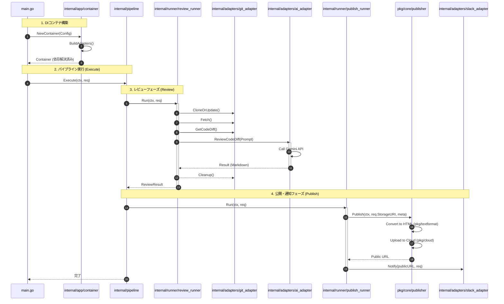

# 🤖 Git Gemini CLI

[](https://golang.org/)
[](https://golang.org/)
[](https://github.com/shouni/git-gemini-cli/tags)
[](https://opensource.org/licenses/MIT)

## 🚀 概要 (About) - 開発効率をブーストする、軽量AIレビューCLI

**Git Gemini CLI** は、AIコードレビューの**コアロジック**を提供する **[Gemini Reviewer Core](https://github.com/shouni/gemini-reviewer-core)** を利用し、その機能をコマンドラインインターフェース（CLI）として実行可能にしたアプリケーションです。

---

## ✨ 技術スタック (Technology Stack)

| 要素 | 技術 / ライブラリ | 役割 |
| :--- | :--- | :--- |
| **言語** | **Go (Golang)** | ツールの開発言語。クロスプラットフォームでの高速な実行を実現します。 |
| **CLI フレームワーク** | **Cobra** | コマンドライン引数（フラグ）の解析とサブコマンド構造 (`generic`, `publish`) の構築に使用します。 |
| **コアレビュー機能** | **[`github.com/shouni/gemini-reviewer-core`](https://github.com/shouni/gemini-reviewer-core)** | **Git操作、AI通信、HTML変換**といった中核のレビューロジックを担う外部ライブラリです。 |

---

## 🏗 システムアーキテクチャ (System Architecture)

### クリーン・ヘキサゴナル

1. **依存性の逆転 (DIP):** `pkg/core` で定義されたインターフェース（ポート）に対してビジネスロジックを記述し、具体的な実装（アダプター）を `internal/adapters` に隠蔽しています。これにより、Git プロバイダーや通知先等の外部環境の変化がビジネスロジックに波及しません。
2. **疎結合なライフサイクル管理:** `internal/builder` を用いて依存関係を一元管理（DI）することで、コンポーネント間の疎結合性を担保し、実行時の差し替えを容易にしています。
3. **セキュリティの透過性:** `pkg/netarmor` や `httpkit` 等の基盤層で、通信や検証の横断的関心事（Cross-cutting concerns）を抽象化し、ビジネスロジックの可読性を保護しています。

---

### レイヤー構成の境界

* **抽象定義層 (`pkg/core`):** システムの核となる**ポート（インターフェース）定義**。ビジネスルールの実行に必要な契約を規定し、外部の具象実装からビジネスロジックを完全に分離します。
* **Application 層 (`internal/pipeline`, `runner`):** ビジネスロジックの心臓部。ポートを介して外部サービスをオーケストレートし、具体的なユースケースを実現します。
* **Infrastructure 層 (`internal/adapters`, `pkg/cloud`, etc.):** 外部世界（Git, AI API, Cloud Storage, Slack）との境界。各ポートに対する具象実装を担います。

---

## 🔄 処理概要

1. **初期化:** `main.go` から `internal/app/container` を介して DI コンテナを構築。
2. **実行:** `internal/pipeline` がオーケストレーターとして各ランナーを順次実行。
3. **レビュー:** `internal/adapters` (Git) を用いた差分取得と、[`github.com/shouni/go-gemini-client`](https://github.com/shouni/go-gemini-client) を経由した Gemini API によるコード分析を実施。
4. **変換/公開:** [`github.com/shouni/go-text-format`](https://github.com/shouni/go-text-format) で Markdown を HTML へ変換し、[`github.com/shouni/go-remote-io`](https://github.com/shouni/go-remote-io)を通じてクラウドストレージへアップロード。
5. **通知:** [`github.com/shouni/go-notifier`](https://github.com/shouni/go-notifier) を経由し、HTML 公開 URL を Slack 等へ通知。

---

### シーケンス



---

## 🎨 概要イメージ


---

## 🛠️ 事前準備と環境設定

### 1\. プロジェクトのセットアップとビルド

```bash
# リポジトリをクローン
git clone git@github.com:shouni/git-gemini-cli.git

# 実行ファイルを bin/ ディレクトリに生成
go build -o bin/git_gemini_cli
```

実行ファイルは、プロジェクトルートの **`./bin/git_gemini_cli`** に生成されます。

---

### 3\. 環境変数の設定 (必須)

Gemini API を利用するために、API キーを環境変数に設定する必要があります。また、連携サービスを使用する場合は、対応する環境変数を設定します。

```bash
# GCP プロジェクトID
export GCP_PROJECT_ID="YOUR_GCP_PROJECT_ID"
# Gemini API キー
export GEMINI_API_KEY="YOUR_GEMINI_API_KEY"
# Slack 連携 (publishモードで保存成功時に公開URLが通知されます)
export SLACK_WEBHOOK_URL="https://hooks.slack.com/services/..."
```

---

## 🤖 プロンプト設定とAIコードレビューの種類 (`--mode` オプション)

本ツールは、レビューの目的に応じて AI に与える指示（**プロンプト**）を切り替えることができます。これは共通フラグの **`-m`, `--mode`** で指定します。

| モード (`-m`) | プロンプトファイル | 目的とレビュー観点 |
| :--- | :--- | :--- |
| **`detail`** | **[`internal/adapters/prompt_detail.md`](internal/adapters/prompt_detail.md)** | **コード品質と保守性の向上**を目的とした詳細なレビュー。可読性、重複、命名規則、一般的なベストプラクティスからの逸脱など、広範囲な技術的側面に焦点を当てます。 |
| **`release`** | **[`internal/adapters/prompt_release.md`](internal/adapters/prompt_release.md)** | **本番リリース可否の判定**を目的としたクリティカルなレビュー。致命的なバグ、セキュリティ脆弱性、サーバーダウンにつながる重大なパフォーマンス問題など、リリースをブロックする問題に限定して指摘します。 |

---

## 🚀 使い方 (Usage) と実行例

このツールは、**リモートリポジトリのブランチ間比較**に特化しており、**サブコマンド**を使用します。

### 🛠 共通フラグ (Persistent Flags)

すべてのサブコマンド (`generic`, `publish`) で使用可能なフラグです。

| フラグ | ショートカット | 説明 | デフォルト値 | 必須 |
| :--- | :--- | :--- | :--- | :--- |
| `--mode` | **`-m`** | レビューモードを指定: `'release'` (リリース判定) または `'detail'` (詳細レビュー) | `detail` | ❌ |
| `--repo-url` | **`-u`** | レビュー対象の Git リポジトリの **SSH URL** | **なし** | ✅ |
| `--base-branch` | **`-b`** | 差分比較の基準ブランチ | `main` | ❌ |
| `--feature-branch` | **`-f`** | レビュー対象のフィーチャーブランチ | **なし** | ✅ |
| `--local-path` | **`-l`** | リポジトリをクローンするローカルパス | 一時ディレクトリ | ❌ |
| `--gemini` | **`-g`** | 使用する Gemini モデル名 (例: `gemini-2.5-flash`) | `gemini-2.5-flash` | ❌ |
| `--ssh-key-path` | **`-k`** | Git 認証用の SSH 秘密鍵のパス。**チルダ (`~`) 展開をサポート**しています。**CI/CD環境ではシークレットマウント先の絶対パス**を指定してください。 | `~/.ssh/id_rsa` | ❌ |
| `--skip-host-key-check` | なし | SSHホストキーチェックをスキップする（**🚨非推奨/危険な設定**）。**`known_hosts`を使用しない**場合に設定します。 | `false` | ❌ |
| `--use-external-git-command` | なし | ローカルのGitコマンド使用する。 | **`true`** | ❌ |

---

### 1\. 標準出力モード (`generic`)

リモートリポジトリのブランチ差分を取得し、レビュー結果を**標準出力**に出力します。

#### 実行コマンド例

```bash
# main と develop の差分をリリース判定モードで実行
./bin/git_gemini_cli generic \
  -m "release" \
  --repo-url "git@example.backlog.jp:PROJECT/repo-name.git" \
  --base-branch "main" \
  --feature-branch "develop"
```

---

### 2\. クラウド保存モード (`publish`) 🌟 (マルチクラウド・**通知対応**)

リモートリポジトリのブランチ比較を行い、その結果を **URI で指定されたクラウドストレージ（GCSまたはS3）** に、**AIが出力したMarkdownを専用ライブラリ（go-text-format）で変換したスタイル付き HTML** として保存します。このモードは、レビュー結果のアーカイブや、CI/CDパイプラインでのレポート生成を目的としています。

**💡 Slack通知について:**
`SLACK_WEBHOOK_URL` 環境変数が設定されている場合、保存成功後に**クラウドストレージに保存された結果の公開URL**が自動的にSlackに通知されます。

#### 実行コマンド例 (GCSへの保存)

```bash
# feature/publish の差分をレビューし、GCSにHTML結果を保存
./bin/git_gemini_cli publish \
  -m "detail" \
  --repo-url "git@example.backlog.jp:PROJECT/repo-name.git" \
  --base-branch "main" \
  --feature-branch "feature/publish" \
  --uri "gs://review-archive-bucket/reviews/2025/latest_review.html" 
```

#### 実行コマンド例 (S3への保存)

```bash
# feature/s3-save の差分をレビューし、S3にHTML結果を保存
./bin/git_gemini_cli publish \
  -m "release" \
  --repo-url "git@example.backlog.jp:PROJECT/repo-name.git" \
  --base-branch "main" \
  --feature-branch "feature/s3-save" \
  --uri "s3://review-report-bucket/reports/2025/latest_release.html" 
```

#### 固有フラグ (クラウド連携)

| フラグ | ショートカット | 説明 | 必須 | デフォルト値 |
| :--- | :--- | :--- | :--- | :--- |
| `--uri` | **`-s`** | 書き込み先 URI (**`gs://...`** または **`s3://...`** をサポート) | ✅ | **なし** |

---

### 📜 ライセンス (License)

このプロジェクトは [MIT License](https://opensource.org/licenses/MIT) の下で公開されています。
